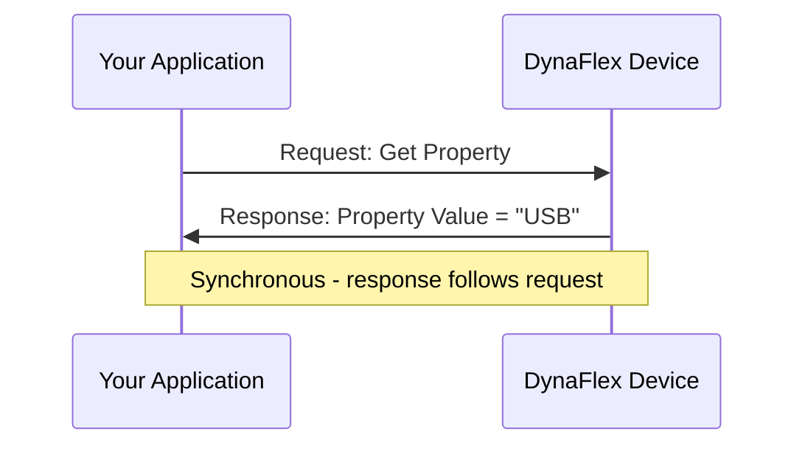
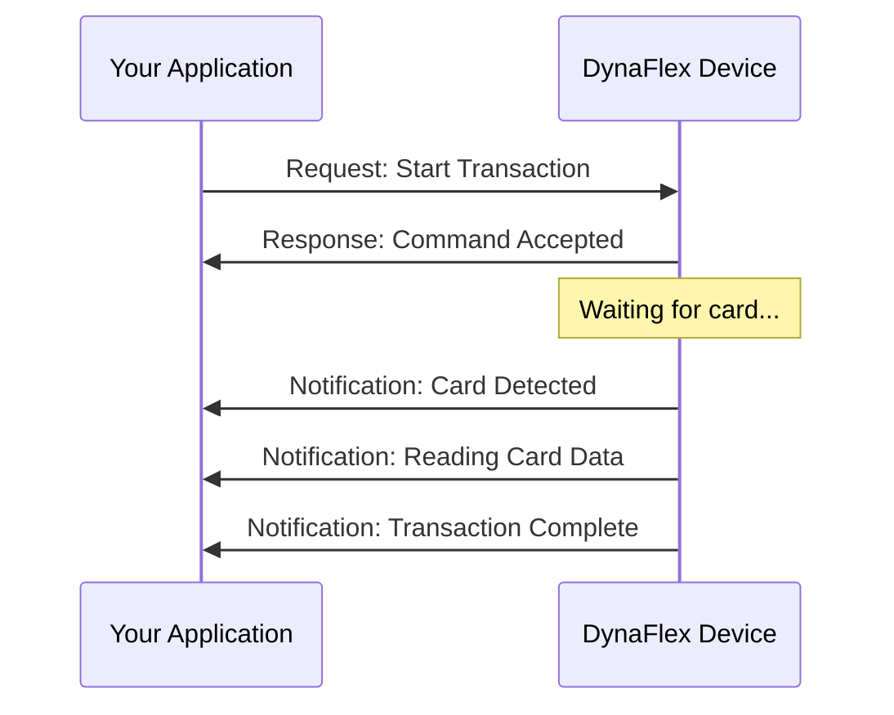
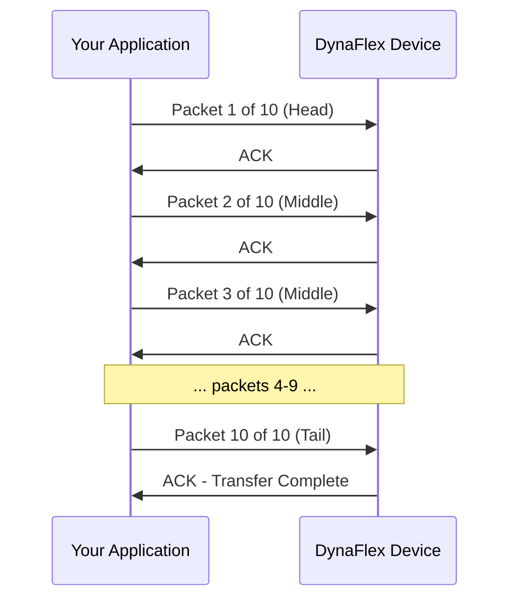
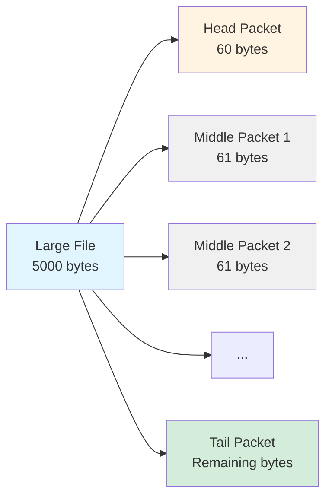
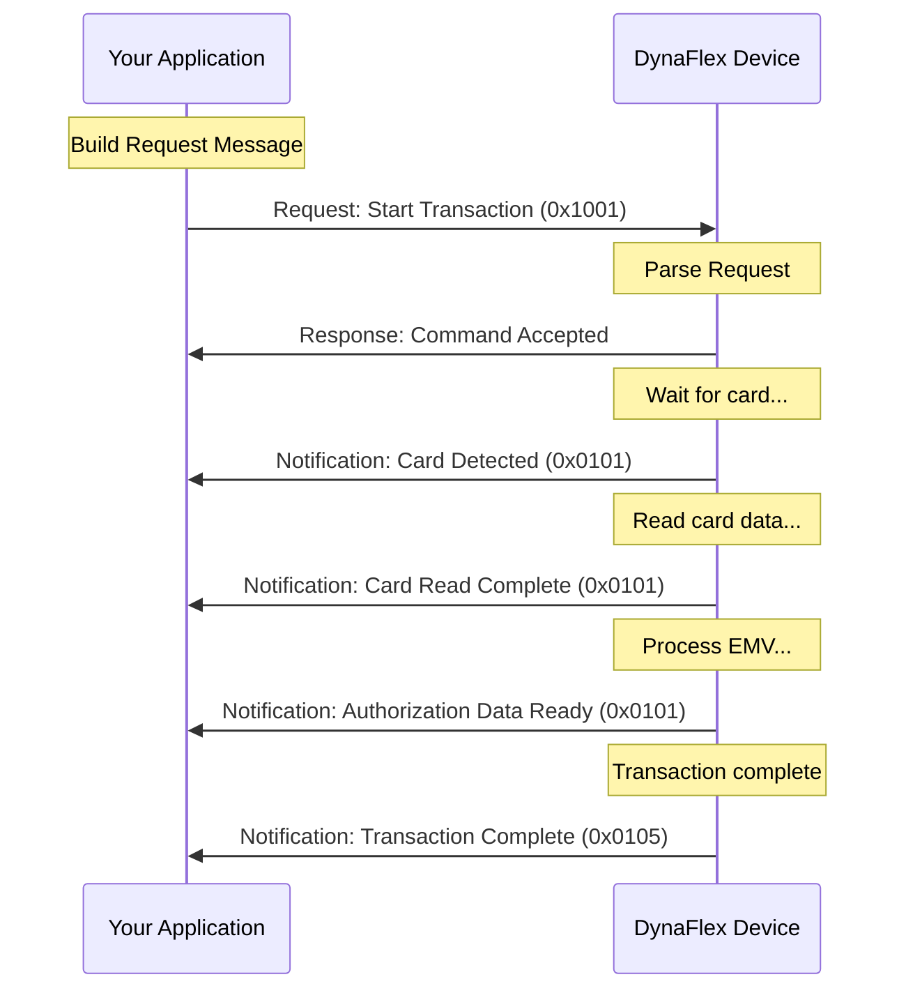

# Understanding Message Structure (Overview)

### Introduction

All communication between your application and DynaFlex devices follows a structured message format. Understanding this structure is essential for successful integration, as every command you send and every response you receive uses this same fundamental pattern.

**In this article:**

* How messages are organized and formatted
* The four types of messages you'll encounter
* How multi-packet messages work for large data transfers
* The relationship between messages and TLV encoding

**Who should read this:**

* Developers integrating DynaFlex devices for the first time
* Technical architects designing payment system communications
* Anyone implementing custom device communication protocols

### What is a Message?

A **message** is a structured unit of communication between your application (the host) and a DynaFlex device. Think of messages as the "sentences" in the conversation between your software and the hardware.

Every message contains:

* **A purpose** - What the message is trying to accomplish (command, response, or notification)
* **Structured data** - Information organized using Tag-Length-Value (TLV) encoding
* **Control information** - Message type, length, and sequencing data

#### Real-World Analogy

Think of messages like postal mail:

* The **envelope** contains routing information (message type, length)
* The **contents** are the actual data you're sending (TLV-encoded parameters)
* The **return address** tells you where responses should go
* **Tracking numbers** help manage multi-part deliveries (multi-packet messages)

Just as you wouldn't mail a letter without an envelope, you don't send data to a DynaFlex device without the proper message structure.

### The Four Types of Messages

DynaFlex devices use four distinct message types, each serving a specific purpose in the communication flow:

#### 1. Request Messages (Host → Device)

**Purpose:** Your application sends a request to tell the device to perform an action.

**Examples:**

* "Start a transaction"
* "Get a configuration property"
* "Display a message on the screen"

**Direction:** Always from host to device

**Response Expected:** Usually yes (but not always)

#### 2. Response Messages (Device → Host)

**Purpose:** The device acknowledges a request and provides results.

**Examples:**

* "Command received successfully"
* "Here's the property value you requested"
* "Transaction failed with error code X"

**Direction:** Always from device to host

**Triggered By:** A request message

#### 3. Notification Messages (Device → Host)

**Purpose:** The device proactively informs your application about events or status changes.

**Examples:**

* "A card was inserted"
* "Transaction is complete"
* "Battery is low"

**Direction:** Always from device to host

**Triggered By:** Events occurring on the device (not a direct request)

**Key Difference from Response:** Notifications are asynchronous - they happen when events occur, not in direct response to a command.

#### 4. Data File Messages (Bidirectional)

**Purpose:** Transfer large files or datasets between host and device.

**Examples:**

* "Loading firmware update file"
* "Uploading EMV configuration"
* "Retrieving batch transaction data"

**Direction:** Can go either way depending on the operation

**Special Characteristic:** Often split into multiple packets due to size

### Message Communication Patterns

#### Pattern 1: Request-Response (Synchronous)

The most common pattern - you ask, the device answers:



**Example:**

1. Your app sends: "Get Property - Device Model Name"
2. Device responds: "DynaFlex Model XYZ"

#### Pattern 2: Request-Response-Notifications (Asynchronous)

For operations that take time, the device sends notifications as events occur:



**Example:**

1. Your app sends: "Start Transaction"
2. Device responds: "OK, waiting for card"
3. Device notifies: "Card inserted"
4. Device notifies: "Card data read"
5. Device notifies: "Transaction complete"

**Important:** Your application must listen for notifications asynchronously - they arrive when events happen, not immediately after your request.

#### Pattern 3: Multi-Packet Transfer

For large data (firmware files, configuration files), messages are split into multiple packets:



### Message Structure Overview

All messages share a common structure, though details vary by message type:

#### Basic Message Anatomy

```
┌─────────────────────────────────────────────────┐
│  Message Header                                 │
│  - Message Type (1 byte)                        │
│  - Message Length (2 bytes)                     │
├─────────────────────────────────────────────────┤
│  Message Payload (TLV-Encoded Data)             │
│  - Tag 1: Length, Value                         │
│  - Tag 2: Length, Value                         │
│  - Tag N: Length, Value                         │
└─────────────────────────────────────────────────┘
```

#### Message Header Components

| Component          | Size    | Purpose                         | Example                |
| ------------------ | ------- | ------------------------------- | ---------------------- |
| **Message Type**   | 1 byte  | Identifies the message category | `0x02` = Response      |
| **Message Length** | 2 bytes | Total length of message payload | `0x00 0x10` = 16 bytes |

#### Message Payload (TLV Format)

The payload contains the actual data, organized as Tag-Length-Value triplets:

```
Tag: What this data represents (1-2 bytes)
Length: How many bytes of data follow (1-2 bytes)
Value: The actual data (variable length)
```

**Example Payload:**

```
80 02 03 E8    = Tag 80 (Amount), Length 2, Value 1000 ($10.00)
82 01 00       = Tag 82 (Type), Length 1, Value 0 (Purchase)
```

For detailed information on TLV encoding, see TLV Encoding Explained.

### Request Messages in Detail

Request messages are how your application tells the device what to do.

#### Request Message Format

```
┌──────────────────────────────────────────┐
│  0x01 (Request Type Indicator)           │
├──────────────────────────────────────────┤
│  Length (2 bytes)                        │
├──────────────────────────────────────────┤
│  Command ID (2 bytes)                    │
│  Example: 0x10 0x01 = Start Transaction │
├──────────────────────────────────────────┤
│  Command Parameters (TLV format)         │
│  - Tag 80: Transaction Amount            │
│  - Tag 82: Transaction Type              │
│  - Tag 83: Additional Options            │
└──────────────────────────────────────────┘
```

#### Request Example

**Scenario:** Start a $10.00 purchase transaction

**Message Breakdown:**

```
01              Message Type = Request
00 0C           Message Length = 12 bytes
10 01           Command ID = 0x1001 (Start Transaction)
80 02 03 E8     Tag 80 = Amount, 1000 cents ($10.00)
82 01 00        Tag 82 = Type, Purchase (0x00)
```

**Complete Hex:**

```
01 00 0C 10 01 80 02 03 E8 82 01 00
```

### Response Messages in Detail

Response messages are the device's acknowledgment of your request.

#### Response Message Format

```
┌──────────────────────────────────────────┐
│  0x02 (Response Type Indicator)          │
├──────────────────────────────────────────┤
│  Length (2 bytes)                        │
├──────────────────────────────────────────┤
│  Command ID (2 bytes - echoed)           │
│  Same as the request command ID          │
├──────────────────────────────────────────┤
│  Status Information (TLV format)         │
│  - Tag 01: Operation Status (required)   │
│  - Tag 02: Status Detail (conditional)   │
│  - Tag 80+: Response Data (optional)     │
└──────────────────────────────────────────┘
```

#### Response Status Codes

Every response includes a status code in Tag 01:

| Status Code | Meaning           | Next Action                          |
| ----------- | ----------------- | ------------------------------------ |
| `0x00`      | Success           | Process response data                |
| `0x01`      | Operation Failed  | Check Tag 02 for details             |
| `0x02`      | Invalid Parameter | Review request parameters            |
| `0x03`      | Not Supported     | Command not available on this device |

#### Response Example

**Scenario:** Successful acknowledgment of Start Transaction command

**Message Breakdown:**

```
02              Message Type = Response
00 05           Message Length = 5 bytes
10 01           Command ID = 0x1001 (echoed from request)
01 01 00        Tag 01 = Status, Success (0x00)
```

**Complete Hex:**

```
02 00 05 10 01 01 01 00
```

### Notification Messages in Detail

Notifications are how the device tells you about events without being asked.

#### Notification Message Format

```
┌──────────────────────────────────────────┐
│  0x03 (Notification Type Indicator)      │
├──────────────────────────────────────────┤
│  Length (2 bytes)                        │
├──────────────────────────────────────────┤
│  Notification ID (2 bytes)               │
│  Example: 0x01 0x01 = Transaction Update │
├──────────────────────────────────────────┤
│  Notification Data (TLV format)          │
│  - Tag 01: Notification Code             │
│  - Tag 02: Detail Code                   │
│  - Tag 80+: Event Data                   │
└──────────────────────────────────────────┘
```

#### Common Notification Types

| Notification ID | Name                           | When It Occurs                |
| --------------- | ------------------------------ | ----------------------------- |
| `0x0101`        | Transaction Information Update | During transaction processing |
| `0x0105`        | Transaction Operation Complete | Transaction finished          |
| `0x1001`        | Device Information Update      | Device status changed         |
| `0x1803`        | User Interface Host Action     | Device needs host decision    |

#### Notification Example

**Scenario:** Card detected during transaction

**Message Breakdown:**

```
03              Message Type = Notification
00 08           Message Length = 8 bytes
01 01           Notification ID = 0x0101 (Transaction Info Update)
01 02 01 00     Tag 01 = Notification Code, Card Detected
02 01 01        Tag 02 = Card Type, Contact EMV
```

**Complete Hex:**

```
03 00 08 01 01 01 02 01 00 02 01 01
```

### Multi-Packet Messages

When data is too large to fit in a single message (typically > 60 bytes), it's split into multiple packets.

#### Packet Types

**Head Packet:** First packet, contains overall information **Middle Packets:** Intermediate packets with sequential data **Tail Packet:** Final packet, signals completion

#### Multi-Packet Structure



#### Multi-Packet Example

**Scenario:** Uploading a 200-byte configuration file

**Packet 1 (Head):**

```
01 00 3C ...  [60 bytes of data] ...
```

**Packet 2 (Middle):**

```
01 00 3D ...  [61 bytes of data] ...
```

**Packet 3 (Middle):**

```
01 00 3D ...  [61 bytes of data] ...
```

**Packet 4 (Tail):**

```
01 00 12 ...  [18 bytes of data] ...
```

**Important:** Your application must:

* Send packets in sequence
* Wait for acknowledgment between packets
* Handle retransmission if a packet fails

### How Messages Relate to Commands

Every **command** you execute involves messages:

1. **You construct a Request Message** containing the command ID and parameters
2. **Device sends a Response Message** acknowledging receipt
3. **Device may send Notification Messages** as the command executes
4. **Device sends a final Notification** when the command completes

#### Example: Complete Message Flow for a Transaction



**Messages Involved:**

* 1 Request Message (your command)
* 1 Response Message (acknowledgment)
* 4 Notification Messages (events during processing)

### Connection Types and Message Formats

Different connection types may wrap messages differently, but the core structure remains the same:

#### USB HID Connection

* Messages sent as HID reports (64-byte packets)
* Automatic packet handling by USB driver
* No additional framing needed

#### WLAN/TCP Connection

* Messages sent as TCP packets
* May need to handle message boundaries
* Additional length prefix may be used

#### Bluetooth LE Connection

* Messages sent via GATT characteristics
* Size limited by MTU (typically 23-512 bytes)
* May require multi-packet for larger messages

#### RS-232/UART with SLIP

* Messages wrapped in SLIP framing
* Special escape characters for message boundaries
* See SLIP protocol documentation

**Important:** Regardless of connection type, the message structure (Type, Length, Payload) remains consistent. The connection layer handles transport; your application works with the message layer.

### Best Practice&#x73;**✅ Recommended Practices:**

* **Always validate message length** before parsing to prevent buffer overruns
* **Check status codes** in every response before processing data
* **Implement asynchronous notification handling** - don't block waiting for them
* **Buffer incoming notifications** if processing takes time
* **Log messages during development** to understand communication patterns
*   **Use timeouts** when waiting for responses (typically 5-30 seconds depending on operation)

    <div data-gb-custom-block data-tag="hint" data-style="warning" class="hint hint-warning"><p><strong>⚠️ Common Pitfalls:</strong></p></div>
* **Ignoring notifications** - your application must handle them or data will be lost
* **Assuming immediate response** - some commands take time to execute
* **Not handling multi-packet messages** - large data transfers will fail
* **Hardcoding message lengths** - always read the length field dynamically
* **Blocking on notification wait** - use event-driven or callback-based handling## Implementation Considerations

#### Message Parsing Strategy

```csharp
// Good: Dynamic parsing based on length field
byte[] message = ReceiveMessage();
byte messageType = message[0];
int messageLength = (message[1] << 8) | message[2];
byte[] payload = new byte[messageLength];
Array.Copy(message, 3, payload, 0, messageLength);

// Now parse TLV data from payload
```

```csharp
// Bad: Assuming fixed sizes
byte[] message = ReceiveMessage();
byte[] payload = new byte[64];  // Wrong - size varies!
Array.Copy(message, 3, payload, 0, 64);
```

#### Notification Handling Pattern

```csharp
// Recommended: Event-driven architecture
device.NotificationReceived += (sender, notification) => {
    switch (notification.NotificationId)
    {
        case 0x0101:  // Transaction update
            HandleTransactionUpdate(notification);
            break;
        case 0x0105:  // Transaction complete
            HandleTransactionComplete(notification);
            break;
        case 0x1001:  // Device information
            HandleDeviceInfo(notification);
            break;
    }
};
```

#### Timeout Management

Different operations require different timeouts:

| Operation Type    | Recommended Timeout | Reason                     |
| ----------------- | ------------------- | -------------------------- |
| Get Property      | 5 seconds           | Fast operation             |
| Start Transaction | 60 seconds          | Waiting for card insertion |
| Firmware Update   | 5 minutes           | Large file transfer        |
| File Download     | 2 minutes           | Depends on file size       |

### Debugging Messages

#### Enable Message Logging

During development, log all messages to understand the conversation:

```csharp
void LogMessage(byte[] message, string direction)
{
    string hex = BitConverter.ToString(message);
    string type = message[0] switch {
        0x01 => "Request",
        0x02 => "Response",
        0x03 => "Notification",
        0x04 => "Data File",
        _ => "Unknown"
    };
    
    Console.WriteLine($"{direction} {type}: {hex}");
}

// Use it:
LogMessage(requestMessage, "SENT");
LogMessage(responseMessage, "RECEIVED");
```


#### Common Issues and Solutions

**Issue: "No response received"**

* Check connection is active
* Verify message format is correct
* Increase timeout (device may be busy)
* Check if command is supported on your device

**Issue: "Notifications being dropped"**

* Implement proper event handling (don't block)
* Buffer notifications if processing is slow
* Check notification subscription settings

**Issue: "Multi-packet transfer fails"**

* Verify packet sequence is correct
* Check for ACK after each packet
* Ensure total data size matches sum of packets


### Next Steps

Now that you understand message structure:

1. **Learn TLV Encoding:** TLV Encoding Explained - Deep dive into how data is formatted
2. **Try a Simple Command:** Your First Transaction - Put messages into practice
3. **Explore Command Reference:** Command 0xD101 - Get Property - See message structure in action

### Related Topics

**Concepts:**

* TLV Encoding Explained - How message payloads are structured
* EMV Transaction Workflow Overview - Complex message flows

**How-To Guides:**

* USB Connection Setup - Transport layer for messages
* Your First Transaction - Practical message usage

**Commands:**

* Command 0x1001 - Start Transaction - Request/Response/Notification example
* Command 0xD101 - Get Property - Simple request/response example

### Summary

**Key Takeaways:**

* **Four message types:** Request (you send), Response (acknowledgment), Notification (async events), Data File (large transfers)
* **All messages have the same basic structure:** Type, Length, TLV Payload
* **Messages use TLV encoding** for flexible, extensible data formatting
* **Communication patterns vary:** Synchronous (request-response) vs. Asynchronous (with notifications)
* **Multi-packet support** enables large data transfers
* **Connection type doesn't change message structure** - only how messages are transported

**Remember:** Understanding message structure is the foundation for all DynaFlex device communication. Every command, response, and notification follows these patterns. Once you grasp this structure, working with any device command becomes straightforward.

***



