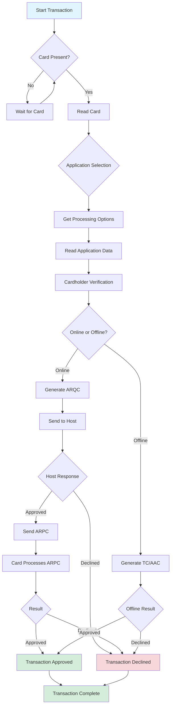
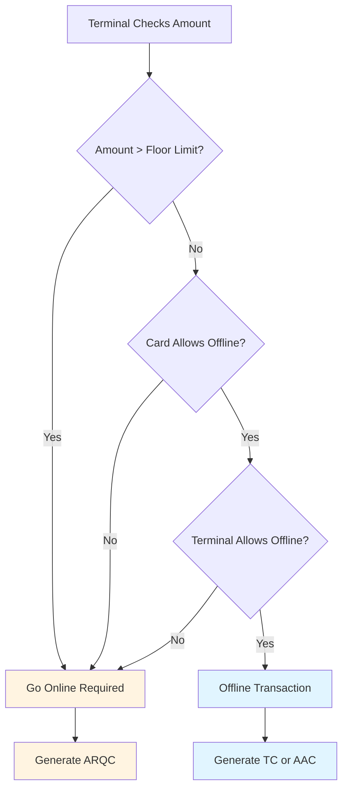
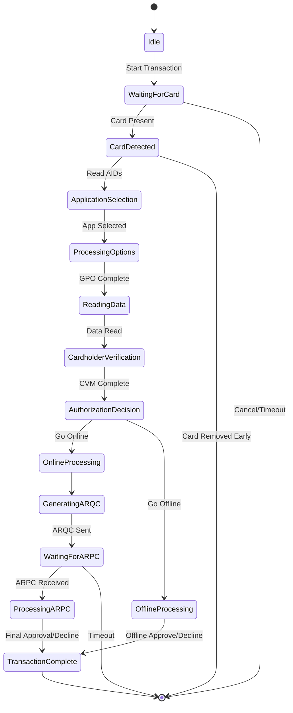

# 4.1 EMV Transaction Workflow Overview

## EMV Transaction Workflow Overview

### Introduction

EMV (Europay, Mastercard, Visa) transactions are more complex than traditional magnetic stripe transactions, involving multiple steps of authentication, authorization, and cryptographic validation. Understanding this workflow is essential for implementing payment processing with DynaFlex devices.

**In this article:**

* The complete EMV transaction lifecycle from start to finish
* Differences between contact and contactless EMV processing
* Decision points and state transitions during a transaction
* How your application interacts with the EMV workflow
* Common transaction outcomes and what they mean

**Who should read this:**

* Developers implementing EMV payment processing
* Technical architects designing payment systems
* Anyone troubleshooting EMV transaction issues
* Integration engineers working with certification requirements

#### **Device Requirements**





#### What is an EMV Transaction?

An **EMV transaction** is a secure payment processed using a chip card (contact) or tap card/phone (contactless). Unlike magnetic stripe cards, EMV cards contain a microprocessor that performs cryptographic operations to verify the card's authenticity and generate unique transaction codes.

#### Real-World Analogy

Think of an EMV transaction like a secure conversation with authentication:

**Magnetic Stripe (Old):**

* Like showing an ID card with your photo
* The information is static and can be copied
* Anyone with a copy can use it

**EMV (Modern):**

* Like having a security guard verify your identity with questions only you can answer
* The card proves it's genuine through cryptographic challenges
* Each transaction generates unique codes that can't be reused
* Even if someone intercepts the data, they can't replay it

### High-Level Transaction Flow

At the highest level, an EMV transaction follows this pattern:



### The Transaction Lifecycle: Step by Step

#### Phase 1: Initiation and Card Detection

**What happens:**

1. Your application sends a Start Transaction command
2. Device enters "waiting for card" state
3. Device displays "INSERT CARD" or "TAP CARD"
4. Customer presents their card

**Your application's role:**

```csharp
// Send Start Transaction command
var command = new StartTransactionCommand();
command.Amount = 1000; // $10.00
command.TransactionType = TransactionType.Purchase;

device.SendCommand(command);

// Device is now waiting for card...
```

**Device notifications you'll receive:**

* `0x0101` - Transaction Information Update: "Waiting for card"
* `0x0101` - Transaction Information Update: "Card detected"

**States:**

```
IDLE → WAITING_FOR_CARD → CARD_DETECTED
```

#### Phase 2: Application Selection

**What happens:**

1. Device reads the card's Application Identifiers (AIDs)
2. Card may support multiple payment applications (Visa, Mastercard, Debit, Credit)
3. Device determines which application to use

**Automatic selection (most common):**

* If only one payment application exists, it's selected automatically
* Device uses configuration to prioritize applications

**Manual selection (when needed):**

* Multiple payment applications are available
* Device requests cardholder to select

**Your application's role:**

If manual selection is needed, you'll receive:

```
Notification 0x1803 - User Interface Host Action Request
Action: Application Selection Required
Available Applications: [List of apps]
```

You respond with:

```csharp
// Report cardholder selection
var response = new ReportCardholderSelection();
response.SelectedApplicationIndex = 1; // User selected second app
device.SendCommand(response);
```

**States:**

```
CARD_DETECTED → APPLICATION_SELECTED
```

#### Phase 3: Processing Options and Data Read

**What happens:**

1. Device sends "Get Processing Options" (GPO) command to card
2. Card responds with Application Interchange Profile (AIP) and Application File Locator (AFL)
3. Device reads all required data from the card
4. This includes: PAN, expiration date, cardholder name, transaction limits, etc.

**Your application's role:**

* None - this happens automatically
* You may receive notification about read progress

**Device notifications:**

```
Notification 0x0101 - Transaction Information Update
Status: Reading card data
Progress: 50%
```

**What's being read:**

* Primary Account Number (PAN)
* Card expiration date
* Cardholder name
* Card risk management data
* Application cryptograms
* Card verification methods

**States:**

```
APPLICATION_SELECTED → READING_DATA → DATA_READ_COMPLETE
```

#### Phase 4: Cardholder Verification

**What happens:** The device determines if cardholder verification is needed and what method to use.

**Verification methods (in priority order):**

1. **No Verification Required**
   * Low amount transactions (under contactless limit)
   * Card configured for "no CVM"
2. **Online PIN**
   * Cardholder enters PIN on device
   * PIN is encrypted and sent to issuer
   * Requires PED (PIN Entry Device) capability
3. **Signature**
   * Cardholder signs on touchscreen or paper
   * Merchant verifies signature matches card
4. **Offline PIN**
   * PIN verified by the card itself
   * Less common in US, more common internationally

**Your application's role:**

For signature capture:

```
Notification 0x1803 - User Interface Host Action Request
Action: Signature Required

Your response:
- Request signature via Command 0x1801
- Or handle signature separately
```

**Device state during PIN entry:**

```
DATA_READ_COMPLETE → CARDHOLDER_VERIFICATION → VERIFICATION_COMPLETE
```

**Important:** PIN entry is handled entirely by the secure device - your application never sees the PIN.

#### Phase 5: Transaction Authorization Decision

**What happens:** The card and terminal work together to decide how to process the transaction.

**Decision tree:**



**Two paths:**

**Path A: Online Authorization (Most Common)**

* Card generates ARQC (Authorization Request Cryptogram)
* ARQC is sent to issuer for approval
* Issuer responds with ARPC (Authorization Response Cryptogram)
* Card validates ARPC and approves/declines

**Path B: Offline Authorization (Rare)**

* Card approves or declines without contacting issuer
* Generates TC (Transaction Certificate) if approved
* Generates AAC (Application Authentication Cryptogram) if declined
* Typically only for very small amounts or when offline capability configured

#### Phase 6: Online Processing (Most Transactions)

**What happens:**

1. Device generates ARQC containing transaction data
2. Your application receives ARQC in a notification
3. You send ARQC to your payment processor/acquirer
4. Processor contacts card issuer
5. Issuer approves or declines
6. You receive authorization response with ARPC
7. You send ARPC back to device
8. Card validates ARPC and completes transaction

**Your application's role - Critical!**

**Step 1: Receive ARQC**

```csharp
// Notification received
Notification 0x0101 - Transaction Information Update
NotificationCode: ARQC Data Ready
Payload: [Encrypted ARQC data]

// Extract ARQC
var arqc = notification.GetTag(0xDF59); // ARQC container
```

**Step 2: Send to processor**

```csharp
// Send to your payment processor
var authRequest = new AuthorizationRequest();
authRequest.ARQC = arqc;
authRequest.Amount = 1000;

var authResponse = await paymentProcessor.Authorize(authRequest);
```

**Step 3: Return ARPC to device**

```csharp
// Resume transaction with ARPC
var resumeCommand = new ResumeTransactionCommand();
resumeCommand.ARPC = authResponse.ARPC;
resumeCommand.AuthorizationCode = authResponse.ApprovalCode;

device.SendCommand(resumeCommand);
```

**Timing is critical:**

* Typical timeout: 30-60 seconds for online authorization
* If timeout occurs, transaction may go to offline decline
* ARQC must be sent to processor immediately

**States:**

```
VERIFICATION_COMPLETE → GENERATING_ARQC → ARQC_READY → 
WAITING_FOR_ARPC → ARPC_RECEIVED → PROCESSING_ARPC
```

#### Phase 7: Transaction Completion

**What happens:**

1. Card processes the authorization response
2. Card generates final approval or decline
3. Device updates transaction status
4. Device displays result to cardholder
5. Transaction data is stored for settlement

**Your application's role:** Receive final notification:

```csharp
Notification 0x0105 - Transaction Operation Complete
Result: Approved / Declined
Reason Code: [specific code]
Batch Data: [encrypted transaction record]
```

**Possible outcomes:**

| Outcome                           | Code   | Meaning                         | Next Action                          |
| --------------------------------- | ------ | ------------------------------- | ------------------------------------ |
| **Approved**                      | `0x00` | Transaction successful          | Store batch data for settlement      |
| **Declined**                      | `0x01` | Card or issuer declined         | Display decline message              |
| **Declined - Try Again**          | `0x02` | Communication error             | Retry transaction                    |
| **Approved - Signature Required** | `0x03` | Approved but needs signature    | Capture signature                    |
| **Quick Chip Deferred**           | `0x10` | Approved, get online auth later | Process normally, auth in background |

**Final states:**

```
PROCESSING_ARPC → APPROVED / DECLINED → COMPLETE
```

### Contact vs. Contactless Differences

#### Contact EMV (Chip Card Insert)

**Characteristics:**

* Card is inserted and remains in device during transaction
* Supports Online PIN entry
* Full EMV functionality available
* Slightly slower (2-3 seconds for card read)

**Workflow specifics:**

```
1. Customer inserts card
2. Device powers card and establishes connection
3. Full application selection process
4. Complete data reading
5. PIN entry if required (on device)
6. Online authorization
7. Customer removes card when prompted
```

**Customer experience:**

* INSERT CARD → PROCESSING → APPROVED → REMOVE CARD
* Total time: 5-15 seconds (depending on online auth)

#### Contactless EMV (Tap to Pay)

**Characteristics:**

* Card is tapped briefly on device
* Fast transaction (< 1 second for card communication)
* May have amount limits for no-PIN transactions
* Supports mobile wallets (Apple Pay, Google Pay)

**Workflow specifics:**

```
1. Customer taps card/phone
2. Device reads all data in single RF burst
3. Simplified application selection
4. Quick data read
5. Usually no PIN for small amounts
6. May complete offline or online
7. Transaction complete - no card removal needed
```

**Customer experience:**

* TAP CARD → APPROVED (for small amounts)
* Total time: 1-3 seconds

**Amount limits:**

* Typically $50-$250 for no-verification contactless
* Above limit: may require PIN or signature
* Limits configurable by merchant/acquirer

#### Quick Comparison

| Aspect              | Contact         | Contactless                              |
| ------------------- | --------------- | ---------------------------------------- |
| **Speed**           | 5-15 seconds    | 1-3 seconds                              |
| **Customer Action** | Insert and wait | Tap and go                               |
| **PIN Entry**       | On device       | Usually not needed (low amounts)         |
| **Amount Limits**   | None            | Configurable (typically $50-$250 no-PIN) |
| **Mobile Wallets**  | No              | Yes (Apple Pay, Google Pay, etc.)        |
| **Offline Capable** | Rare            | More common                              |

### Quick Chip Mode

**Quick Chip** is an optimization that allows the customer to remove their card before online authorization completes.

#### Standard Flow:

```
INSERT CARD → READ → ONLINE AUTH (wait 3-5 sec) → APPROVED → REMOVE CARD
Total time: 8-12 seconds, card must remain inserted
```

#### Quick Chip Flow:

```
INSERT CARD → READ → REMOVE CARD → ONLINE AUTH (background) → APPROVED
Total time: 3-5 seconds card inserted, customer can leave while auth completes
```

**How it works:**

1. Device reads all card data quickly
2. Card generates ARQC
3. Customer removes card and can leave
4. Your app gets ARQC and sends to processor
5. Authorization completes in background
6. If declined after customer left, void/reversal handled separately

**Benefits:**

* Faster customer experience
* Reduced queue times
* Card not tied up during slow network authorization

**Considerations:**

* Must handle late declines gracefully
* Signature capture happens before card removal
* Requires specific EMV kernel configuration

### Transaction States Reference

#### Complete State Diagram



#### State Descriptions

| State                      | Description                    | Typical Duration     | Can Cancel? |
| -------------------------- | ------------------------------ | -------------------- | ----------- |
| **Idle**                   | No transaction in progress     | N/A                  | N/A         |
| **WaitingForCard**         | Device ready, waiting for card | Until card presented | Yes         |
| **CardDetected**           | Card present, initializing     | < 1 second           | No          |
| **ApplicationSelection**   | Choosing payment app           | < 1 second           | No          |
| **ProcessingOptions**      | Getting card capabilities      | < 1 second           | No          |
| **ReadingData**            | Reading all card data          | 1-2 seconds          | No          |
| **CardholderVerification** | PIN or signature               | 10-30 seconds        | Yes         |
| **AuthorizationDecision**  | Online vs offline              | < 1 second           | No          |
| **GeneratingARQC**         | Creating auth request          | < 1 second           | No          |
| **WaitingForARPC**         | Waiting for host               | 3-10 seconds         | Limited     |
| **ProcessingARPC**         | Card validating response       | < 1 second           | No          |
| **TransactionComplete**    | Final state                    | N/A                  | No          |

### Common Transaction Scenarios

#### Scenario 1: Successful Contact EMV with PIN

```
1. Customer inserts chip card
   → Device: "Card detected"
   
2. Device reads card, one Visa debit app found
   → Automatic selection
   
3. Device reads all card data
   → Notification: "Reading card"
   
4. Amount $50.00 requires PIN
   → Device: "ENTER PIN"
   → Customer enters PIN on device
   
5. Terminal requests online authorization
   → Device generates ARQC
   → Your app: Send ARQC to processor
   
6. Processor approves
   → Your app: Send ARPC to device
   → Device: "APPROVED"
   → Customer removes card
   
Total time: ~12 seconds
```

#### Scenario 2: Contactless Small Purchase (No PIN)

```
1. Customer taps card ($15.00 purchase)
   → Device: "Card detected"
   
2. Device reads all data in < 1 second
   → One Visa credit app, auto-selected
   
3. Amount under contactless limit, no CVM needed
   → Skip PIN/signature
   
4. Terminal goes online
   → ARQC generated
   → Your app sends to processor
   → Processor approves
   → ARPC sent to device
   
5. Device: "APPROVED"
   
Total time: ~3 seconds
```

#### Scenario 3: Multiple Applications - User Selection

```
1. Customer inserts card
   → Device detects multiple apps (Visa Debit, Visa Credit)
   
2. Device needs user to choose
   → Notification 0x1803: Application selection required
   → Your app displays: "Checking or Credit?"
   → Customer selects "Credit"
   → Your app sends selection to device
   
3. Transaction continues with selected app
   → [Normal flow from here]
```

#### Scenario 4: Declined Transaction

```
1. [Normal flow through ARQC generation]
   
2. Your app sends ARQC to processor
   → Processor contacts issuer
   → Issuer declines: "INSUFFICIENT FUNDS"
   
3. Your app sends decline response to device
   → Device processes decline
   → Device: "DECLINED"
   → Notification 0x0105: Transaction declined, code 0x51
   
4. Customer removes card
```

#### Scenario 5: Fallback to Magnetic Stripe

```
1. Customer inserts chip card
   → Device attempts to read chip
   → Chip read fails (damaged chip)
   
2. Device: "CHIP ERROR - USE MAGNETIC STRIPE"
   → Customer removes card
   
3. Device enters MSR mode
   → Customer swipes card
   → Magnetic stripe read
   → Transaction processed as MSR
```

### Error Handling and Edge Cases

#### Card Removed Too Early

**Symptom:** Customer removes card during transaction

**Handling:**

```
If state = ReadingData or CardholderVerification:
  → Transaction aborted
  → Notification: "Card removed - transaction cancelled"
  → Display: "TRANSACTION CANCELLED"

If state = WaitingForARPC (Quick Chip):
  → OK - authorization continues in background
```

#### ARPC Timeout

**Symptom:** No response from processor within timeout period

**Handling:**

```
After 30-60 seconds with no ARPC:
  → Device times out
  → Notification 0x0105: Transaction declined - timeout
  → Your app should:
    1. Log the timeout
    2. May attempt reversal with processor
    3. Display appropriate message
```

#### Multiple Online Attempts (Chip Decline Fallback)

**Scenario:** Chip transaction declined, issuer suggests retry

**Flow:**

```
1. First attempt declined with "Try Again" code
2. Device may automatically retry
3. If second attempt also declines:
   → Device: "DECLINED"
   → Do NOT fall back to MSR for chip cards
   → This prevents fraud
```

#### Offline Decline with Store and Forward

**Scenario:** Transaction approved offline, later declined by issuer

**Handling:**

```
1. Offline transaction approved (TC generated)
2. Transaction stored in batch
3. During settlement, issuer declines
4. Your system must handle:
   → Reverse the offline approval
   → Contact merchant for recovery
   → Do not repeat card storage
```

### Best Practices for EMV Integration

#### **Recommended Practices:**

**Timing and Performance:**

* **Set appropriate timeouts** - 30-60 seconds for online authorization
* **Don't block UI** - Handle ARQC/ARPC asynchronously
* **Implement Quick Chip** - Improves customer experience significantly
* **Cache configuration** - Don't reload EMV configs on every transaction

**Error Handling:**

* **Always handle all notification types** - Don't assume success path only
* **Log ARQC and ARPC** - Essential for troubleshooting and chargebacks
* **Implement retry logic** - For network timeouts, not card declines
* **Handle partial transactions** - User cancellations, card removals, etc.

**Security and Compliance:**

* **Never log card data unencrypted** - Use encrypted batch data only
* **Validate ARPC before sending to card** - Ensure it's from your processor
* **Implement proper key management** - For ARQC/ARPC encryption
* **Follow EMV certification requirements** - Don't modify EMV flows

**User Experience:**

* **Provide clear prompts** - "INSERT CARD", "ENTER PIN", "REMOVE CARD"
* **Show progress** - "Reading card...", "Authorizing...", "Approved"
* **Handle errors gracefully** - Clear error messages, not technical codes
* **Support accessibility** - Audio prompts, appropriate timeouts

#### **Common Pitfalls:**

**Transaction Flow:**

* **Don't assume immediate approval** - Wait for final completion notification
* **Don't skip ARPC step** - Card must validate issuer response
* **Don't allow MSR fallback for chip cards** - Security risk and compliance issue
* **Don't process offline approvals without proper configuration** - Ensure you understand risk

**Data Handling:**

* **Never store full card data unencrypted** - PCI DSS violation
* **Don't parse EMV data manually** - Use device-provided encrypted containers
* **Don't log PINs or CVVs** - Never accessible to your application
* **Don't reuse ARQC/ARPC data** - Each transaction is unique

**Integration:**

* **Don't hardcode timeout values too short** - Network latency varies
* **Don't ignore notification subscription** - May miss critical events
* **Don't modify EMV kernel configurations without expertise** - Can break certification
* **Don't test with production cards** - Use test cards during development## Implementation Checklist

#### Basic EMV Transaction Support

```
Required for basic functionality:

□ Send Start Transaction command with amount
□ Handle "waiting for card" notification
□ Handle "card detected" notification
□ Handle "ARQC ready" notification
□ Extract ARQC from notification
□ Send ARQC to payment processor
□ Receive authorization response from processor
□ Send ARPC to device via Resume Transaction
□ Handle "transaction complete" notification
□ Store encrypted batch data for settlement
□ Display transaction result to user
```

#### Advanced EMV Support

```
Optional but recommended:

□ Application selection handling (multiple apps on card)
□ Signature capture integration
□ Quick Chip mode support
□ Contactless transaction support
□ Error recovery and retry logic
□ Offline transaction support (if configured)
□ Reversal handling for timeouts
□ Detailed transaction logging
□ Receipt generation with EMV data
□ Fallback to MSR (when chip fails - proper flow)
```

#### Testing Requirements

```
Test scenarios you must verify:

Contact EMV:
□ Successful approval with PIN
□ Successful approval with signature
□ Successful approval with no CVM
□ Declined transaction
□ Card removed early
□ Authorization timeout
□ Multiple payment apps on card
□ Offline-capable card

Contactless EMV:
□ Small amount (under limit) - no PIN
□ Large amount - PIN required
□ Contactless limit enforcement
□ Mobile wallet (Apple Pay / Google Pay)
□ Multiple taps (duplicate transaction prevention)

Error Scenarios:
□ Network timeout during auth
□ Invalid ARPC response
□ Card communication error
□ User cancellation at various stages
□ Power loss during transaction
```

### Troubleshooting Guide

#### Transaction Never Completes

**Possible causes:**

1. Not handling notifications properly
2. Not sending ARPC back to device
3. Timeout too short for network latency
4. Device not properly initialized

**Debug steps:**

```
1. Enable notification logging
2. Verify you receive notification 0x0101 with ARQC
3. Verify you send Resume Transaction with ARPC
4. Check timeout values (should be 30-60 seconds)
5. Test with known-good test card
```

#### "Card Read Error" Frequently

**Possible causes:**

1. Damaged chip card
2. Reader contacts dirty
3. Card inserted too slowly/quickly
4. EMV configuration issue

**Debug steps:**

```
1. Try multiple different cards
2. Clean card reader contacts
3. Verify EMV configuration loaded
4. Check firmware version compatibility
```

#### Contactless Not Working

**Possible causes:**

1. Contactless not enabled in configuration
2. Card held too far from reader
3. Card moved too quickly
4. Contactless limits not configured

**Debug steps:**

```
1. Verify device has contactless capability
2. Check contactless reader enabled in config
3. Test with known contactless card
4. Verify CVM limits configured
5. Check EMV Entry Point configuration
```

#### ARPC Validation Fails

**Possible causes:**

1. Incorrect ARPC from processor
2. ARPC corrupted in transmission
3. Wrong cryptographic keys
4. ARPC format mismatch

**Debug steps:**

```
1. Log ARQC and ARPC (hex format)
2. Verify ARPC is from your processor (not cached)
3. Check with processor that ARPC is correct
4. Verify key injection completed successfully
5. Review EMV certification settings
```

### Next Steps

Now that you understand EMV transaction workflows:

1. **Implement Your First Transaction:** Your First Transaction Tutorial - Hands-on EMV implementation
2. **Study Command Details:** Command 0x1001 - Start Transaction - Complete command reference
3. **Review Message Structure:** Understanding Message Structure - How ARQC/ARPC are formatted
4. **Configure EMV Settings:** EMV Configuration - EMV kernel setup

### Related Topics

**Transaction Processing:**

* MSR Transaction Workflows - Magnetic stripe processing
* Contactless Transaction Details - NFC-specific flows
* Quick Chip Configuration - Optimizing transaction speed

**Commands:**

* Command 0x1001 - Start Transaction - Initiating EMV transactions
* Command 0x1004 - Resume Transaction - Sending ARPC
* Command 0x1008 - Cancel Transaction - Aborting in-progress transactions

**Data Formats:**

* EMV ARQC Format - Authorization request data
* EMV ARPC Format - Authorization response data
* EMV Batch Data - Settlement data format

**Notifications:**

* Notification 0x0101 - Transaction Information Update
* Notification 0x0105 - Transaction Operation Complete
* Notification 0x1803 - User Interface Host Action Request

### Summary

**Key Takeaways:**

* **EMV transactions involve multiple steps** - Card detection, application selection, data read, CVM, authorization, completion
* **Two main paths: Online and Offline** - Online requires host authorization (most common), offline is card-only
* **Your app's critical role: ARQC/ARPC handling** - Receive ARQC, send to processor, return ARPC to device
* **Contact vs. Contactless differ mainly in speed** - Same basic flow, contactless is faster and may skip CVM for small amounts
* **State management is essential** - Understand where you are in the flow to handle errors properly
* **Quick Chip improves customer experience** - Card can be removed while online auth completes in background

**Remember:** EMV transactions are complex, but the device handles most of the complexity. Your application's main responsibilities are: initiating the transaction, handling ARQC/ARPC exchange with your processor, and managing the user experience. Understanding the workflow helps you handle edge cases and provide better troubleshooting.

\---


**Need Help?**

For additional support, please contact MagTek Support:

**Technical Support:**

* 📧 **Email:** support@magtek.com
* 📞 **Phone:** 1-800-788-6835 (US) | +1-562-546-6616 (International)
* 🕐 **Hours:** Monday-Friday, 6:00 AM - 5:00 PM PST

**Online Resources:**

* 🌐 **Support Portal:** [https://www.magtek.com/support](https://www.magtek.com/support)
* 📚 **Knowledge Base:** [https://support.magtek.com](https://support.magtek.com)
* 💬 **EMV Certification Support:** [emv-support@magtek.com](mailto:emv-support@magtek.com)

**Documentation Feedback:** Help us improve this documentation! Submit feedback

