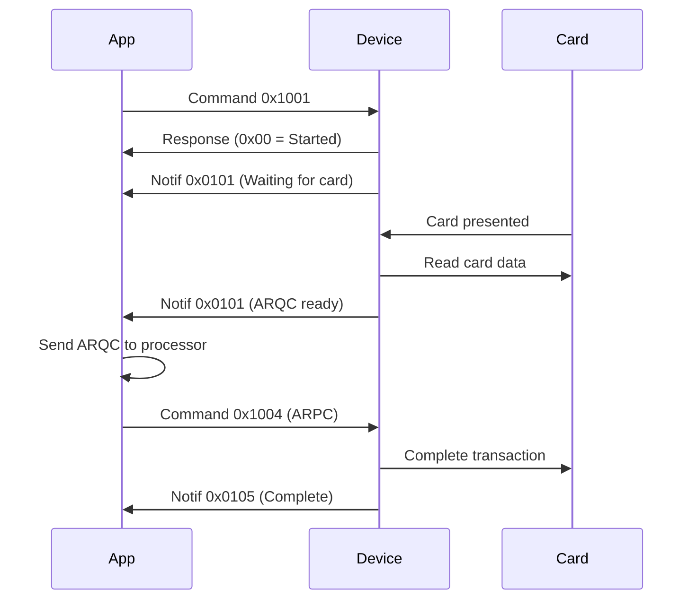

# 5.2.1 0x001 - Start Transaction

## Command 0x1001: Start Transaction

### Overview

Command 0x1001 initiates a payment transaction and enables the configured card readers (MSR, ICC, PICC). This is the primary command for processing payments.

**Command ID:** `0x1001`\
**Command Type:** Request/Response with Notifications\
**Minimum Firmware:** All versions\
**Device Requirements:** Any DynaFlex family device

### Quick Reference

```python
# Basic contactless transaction
message = build_command_1001(
    amount=1250,           # $12.50
    currency=0x0840,       # USD
    trans_type=0x00,       # Purchase
    readers=0x02           # PICC only
)
```

### Command Structure

#### Request Format

```
┌─────────────────────────────────────────────────┐
│ USB HID Report (64 bytes)                       │
├─────────────────────────────────────────────────┤
│ Byte 0: Report ID (0x00)                        │
│ Bytes 1-2: Message Length (variable)            │
│ Byte 3: Message Type (0x02 = Request)           │
│ Bytes 4-5: Command ID (0x10 0x01)               │
│ Bytes 6+: TLV Parameters                        │
└─────────────────────────────────────────────────┘
```

#### Response Format

```
┌─────────────────────────────────────────────────┐
│ Immediate Response                               │
├─────────────────────────────────────────────────┤
│ Byte 0: Report ID (0x00)                        │
│ Bytes 1-2: Message Length (0x00 0x04)           │
│ Byte 3: Message Type (0x03 = Response)          │
│ Bytes 4-5: Command ID (0x10 0x01)               │
│ Byte 6: Status Code                             │
└─────────────────────────────────────────────────┘
```

**Status Codes:**

* `0x00` - Success (transaction started)
* `0x01` - Invalid parameter
* `0x02` - Operation failed
* `0x10` - Device busy
* `0x12` - Battery too low (<5%)

#### Notification Flow



### Required Parameters

#### Tag 0x9F02: Transaction Amount

**Format:** 6 bytes, BCD encoded\
**Description:** Transaction amount in smallest currency unit

```python
# Example: $12.50 = 1250 cents
amount_bcd = bytes([0x00, 0x00, 0x00, 0x00, 0x12, 0x50])

# Tag structure
tlv = bytes([
    0x9F, 0x02,  # Tag
    0x06,         # Length
    0x00, 0x00, 0x00, 0x00, 0x12, 0x50  # Value
])
```

**Important Notes:**

* Amount is in **smallest currency unit** (cents for USD)
* Always 6 bytes, zero-padded on left
* BCD encoding: each byte represents two digits
* Maximum: 999,999.99 (0x00 0x00 0x99 0x99 0x99 0x99)

#### Tag 0x5F2A: Currency Code

**Format:** 2 bytes, binary\
**Description:** ISO 4217 currency code

```python
# Common currency codes
USD = 0x0840  # United States Dollar
EUR = 0x0978  # Euro
GBP = 0x0826  # British Pound
CAD = 0x0124  # Canadian Dollar
JPY = 0x0392  # Japanese Yen

# Tag structure
tlv = bytes([
    0x5F, 0x2A,  # Tag
    0x02,         # Length
    0x08, 0x40   # USD
])
```

#### Tag 0x9C: Transaction Type

**Format:** 1 byte\
**Description:** Type of transaction

```python
# Transaction types
PURCHASE        = 0x00  # Standard purchase
CASH_ADVANCE    = 0x01  # ATM cash withdrawal
REFUND          = 0x20  # Credit/refund
CASHBACK        = 0x09  # Purchase with cashback

# Tag structure
tlv = bytes([
    0x9C,  # Tag
    0x01,  # Length
    0x00   # Purchase
])
```

#### Tag 0x81: Reader Options

**Format:** 1 byte, bit field\
**Description:** Enable/disable card readers

```python
# Reader enable bits
ICC_ENABLED  = 0x01  # Bit 0: Contact chip reader
PICC_ENABLED = 0x02  # Bit 1: Contactless reader
MSR_ENABLED  = 0x04  # Bit 2: Magnetic stripe reader

# Examples
ALL_READERS = 0x07  # ICC + PICC + MSR
CONTACTLESS_ONLY = 0x02
CHIP_ONLY = 0x01
NO_SWIPE = 0x03  # ICC + PICC only

# Tag structure
tlv = bytes([
    0x81,  # Tag
    0x01,  # Length
    0x07   # All readers enabled
])
```

### Optional Parameters

#### Tag 0x9F03: Other Amount

**Format:** 6 bytes, BCD\
**Description:** Cashback or secondary amount

```python
# Example: $5.00 cashback
cashback_bcd = bytes([0x00, 0x00, 0x00, 0x00, 0x05, 0x00])

tlv = bytes([
    0x9F, 0x03,  # Tag
    0x06,         # Length
    0x00, 0x00, 0x00, 0x00, 0x05, 0x00
])
```

#### Tag 0x82: Transaction Options

**Format:** 1 byte, bit field\
**Description:** Transaction behavior control

```python
# Option bits
QUICK_CHIP         = 0x01  # Bit 0: Get ARQC before card removal
SUPPRESS_THANK_YOU = 0x02  # Bit 1: Skip "THANK YOU" message
DEVICE_FALLBACK    = 0x04  # Bit 2: Enable device-driven fallback
SIGNATURE_BYPASS   = 0x08  # Bit 4: Bypass signature capture
ONLINE_PIN         = 0x10  # Bit 5: Force online PIN

# Example: Quick Chip with no thank you message
options = QUICK_CHIP | SUPPRESS_THANK_YOU  # 0x03

tlv = bytes([
    0x82,  # Tag
    0x01,  # Length
    0x03   # Value
])
```

#### Tag 0x83: Display Options

**Format:** 1 byte, bit field\
**Description:** Control display behavior

```python
# Display option bits
SHOW_AMOUNT        = 0x01  # Bit 0: Display amount
SHOW_CASHBACK      = 0x02  # Bit 1: Display cashback
APPLE_VAS_ENABLE   = 0x10  # Bit 4: Enable Apple VAS
GOOGLE_VAS_ENABLE  = 0x20  # Bit 5: Enable Google Smart Tap

# Example: Show amount with Apple VAS
display_opts = SHOW_AMOUNT | APPLE_VAS_ENABLE  # 0x11

tlv = bytes([
    0x83,  # Tag
    0x01,  # Length
    0x11   # Value
])
```

#### Tag 0x84: Timeout

**Format:** 1 byte\
**Description:** Transaction timeout in seconds

```python
# Timeout values
DEFAULT_TIMEOUT = 30  # 30 seconds
EXTENDED_TIMEOUT = 60  # 60 seconds
QUICK_TIMEOUT = 10    # 10 seconds

tlv = bytes([
    0x84,  # Tag
    0x01,  # Length
    0x3C   # 60 seconds
])
```

**Valid Range:** 1-255 seconds\
**Default:** 30 seconds

#### Tag 0x85: Final Display Message

**Format:** Variable length ASCII\
**Description:** Custom completion message

```python
# Custom message
message = "APPROVED - THANK YOU"

tlv = bytes([
    0x85,  # Tag
    len(message)  # Length
]) + message.encode('ascii')
```

**Display-only devices:** Shows on screen\
**Non-display devices:** Ignored\
**Maximum length:** 40 characters recommended

#### Tag 0x86: Signature Bypass Control

**Format:** 1 byte\
**Description:** Control signature capture behavior

```python
# Signature control
SIGNATURE_REQUIRED = 0x00  # Always capture
SIGNATURE_OPTIONAL = 0x01  # Skip if under limit
SIGNATURE_NEVER    = 0x02  # Never capture

tlv = bytes([
    0x86,  # Tag
    0x01,  # Length
    0x01   # Optional
])
```

**Touch devices only** - Ignored on display-only devices

#### Tag 0x87: PIN Block Format

**Format:** 1 byte\
**Description:** Specify PIN encryption format

```python
# PIN block formats
ISO_FORMAT_0 = 0x00  # ISO 9564-1 Format 0
ISO_FORMAT_3 = 0x03  # ISO 9564-1 Format 3
ISO_FORMAT_4 = 0x04  # ISO 9564-1 Format 4

tlv = bytes([
    0x87,  # Tag
    0x01,  # Length
    0x00   # ISO Format 0
])
```

**PED devices only** - Requires PIN entry capability

### Complete Example

#### Basic Contactless Purchase

```python
def build_contactless_purchase(amount_cents, currency_code=0x0840):
    """Build a basic contactless purchase transaction"""
    
    # Convert amount to BCD
    amount_str = f"{amount_cents:012d}"
    amount_bcd = bytes([int(amount_str[i:i+2], 16) 
                        for i in range(0, 12, 2)])
    
    # Build TLV parameters
    tlv = bytearray()
    
    # Required: Amount
    tlv.extend([0x9F, 0x02, 0x06])
    tlv.extend(amount_bcd)
    
    # Required: Currency
    tlv.extend([0x5F, 0x2A, 0x02])
    tlv.extend(struct.pack('>H', currency_code))
    
    # Required: Transaction type
    tlv.extend([0x9C, 0x01, 0x00])  # Purchase
    
    # Required: Reader options
    tlv.extend([0x81, 0x01, 0x02])  # PICC only
    
    # Optional: Quick Chip mode
    tlv.extend([0x82, 0x01, 0x01])
    
    # Optional: Display amount
    tlv.extend([0x83, 0x01, 0x01])
    
    # Build complete message
    message = bytearray(64)
    message[0] = 0x00  # Report ID
    message[1] = 0x00  # Length MSB
    message[2] = len(tlv) + 3  # Length LSB
    message[3] = 0x02  # Request
    message[4] = 0x10  # Command MSB
    message[5] = 0x01  # Command LSB
    message[6:6+len(tlv)] = tlv
    
    return bytes(message)

# Usage
msg = build_contactless_purchase(1250)  # $12.50
```

#### Purchase with Cashback

```python
def build_purchase_with_cashback(purchase_amount, cashback_amount):
    """Purchase with cashback (total = purchase + cashback)"""
    
    total = purchase_amount + cashback_amount
    
    # Convert to BCD
    total_bcd = amount_to_bcd(total)
    cashback_bcd = amount_to_bcd(cashback_amount)
    
    tlv = bytearray()
    
    # Total amount (including cashback)
    tlv.extend([0x9F, 0x02, 0x06])
    tlv.extend(total_bcd)
    
    # Cashback amount
    tlv.extend([0x9F, 0x03, 0x06])
    tlv.extend(cashback_bcd)
    
    # Currency
    tlv.extend([0x5F, 0x2A, 0x02, 0x08, 0x40])
    
    # Transaction type: Purchase with cashback
    tlv.extend([0x9C, 0x01, 0x09])
    
    # All readers enabled
    tlv.extend([0x81, 0x01, 0x07])
    
    # Display both amounts
    tlv.extend([0x83, 0x01, 0x03])
    
    return build_message(0x1001, tlv)

# Usage
msg = build_purchase_with_cashback(2000, 500)  # $20 + $5 cashback
```

#### Chip Card with Online PIN

```python
def build_chip_with_pin(amount_cents):
    """Contact chip transaction with PIN entry"""
    
    amount_bcd = amount_to_bcd(amount_cents)
    
    tlv = bytearray()
    
    # Amount
    tlv.extend([0x9F, 0x02, 0x06])
    tlv.extend(amount_bcd)
    
    # Currency
    tlv.extend([0x5F, 0x2A, 0x02, 0x08, 0x40])
    
    # Transaction type
    tlv.extend([0x9C, 0x01, 0x00])
    
    # ICC only (no MSR fallback)
    tlv.extend([0x81, 0x01, 0x01])
    
    # Force online PIN
    tlv.extend([0x82, 0x01, 0x10])
    
    # PIN block format
    tlv.extend([0x87, 0x01, 0x00])  # ISO Format 0
    
    return build_message(0x1001, tlv)
```

#### Manual Card Entry (Touch Only)

```python
def build_manual_entry(enable_mce=True):
    """Enable manual card entry on touch devices"""
    
    tlv = bytearray()
    
    # Amount
    tlv.extend([0x9F, 0x02, 0x06, 0x00, 0x00, 0x00, 0x00, 0x10, 0x00])
    
    # Currency
    tlv.extend([0x5F, 0x2A, 0x02, 0x08, 0x40])
    
    # Transaction type
    tlv.extend([0x9C, 0x01, 0x00])
    
    # Enable all readers + MCE
    # Bit 3: Enable MCE
    readers = 0x07  # ICC + PICC + MSR
    if enable_mce:
        readers |= 0x08
    
    tlv.extend([0x81, 0x01, readers])
    
    return build_message(0x1001, tlv)
```

### Transaction Workflows

#### EMV Contactless (Quick Chip)

```
1. Send Command 0x1001
   ├─ Amount, Currency, Type
   ├─ Reader: PICC only (0x02)
   ├─ Options: Quick Chip (0x01)
   └─ Display: Show amount (0x01)

2. Device Response: 0x00 (Success)

3. Notification 0x0101: "PRESENT CARD"
   └─ Status: Waiting for card

4. [User taps card]

5. Notification 0x0101: "PROCESSING"
   └─ Status: Reading card

6. Notification 0x0101: Data ready
   ├─ Tag 0xDF10: ARQC data
   ├─ Tag 0x50: Application label
   └─ Tag 0x5A: Masked PAN

7. [App sends ARQC to processor]

8. Send Command 0x1004: Resume
   ├─ Tag 0x8A: Auth code ("00")
   └─ Tag 0xDFDF11: ARPC data

9. Notification 0x0105: Complete
   ├─ Tag 0x81: Result (0x01 = Approved)
   └─ Tag 0xDF11: Batch data

10. Display: "APPROVED"
```

#### EMV Contact (Chip Card)

```
1. Send Command 0x1001
   ├─ Reader: ICC only (0x01)
   └─ [Other parameters]

2. Notification: "INSERT CARD"

3. [User inserts card]

4. Notification: "PROCESSING"

5. [Device reads chip]

6. Notification: ARQC ready
   └─ [Same as contactless]

7. [May request PIN if needed]

8. [Authorization flow]

9. Notification: "REMOVE CARD"

10. [Transaction complete]
```

#### MSR (Magnetic Stripe)

```
1. Send Command 0x1001
   ├─ Reader: MSR only (0x04)
   └─ [Other parameters]

2. Notification: "SWIPE CARD"

3. [User swipes card]

4. Notification: Track data ready
   ├─ Encrypted track 1
   ├─ Encrypted track 2
   └─ MagnePrint data

5. [Send to processor]

6. [Receive authorization]

7. Notification: Complete
```

#### Device-Driven Fallback

If chip read fails, device automatically falls back to MSR:

```
1. Command 0x1001
   ├─ Reader: ICC + MSR (0x05)
   └─ Options: Device fallback (0x04)

2. "INSERT CARD"

3. [Chip read fails]

4. "USE CHIP READER FAILED"
   "SWIPE CARD"

5. [User swipes]

6. [MSR transaction proceeds]
```

### Response Handling

#### Success Response

```python
def handle_response(response):
    """Process command response"""
    
    status = response[6]
    
    if status == 0x00:
        print("Transaction started successfully")
        return True
    
    # Handle errors
    error_messages = {
        0x01: "Invalid parameter - check TLV encoding",
        0x02: "Operation failed - device may be offline",
        0x10: "Device busy - cancel current operation",
        0x12: "Battery too low - charge device"
    }
    
    print(f"Error: {error_messages.get(status, 'Unknown error')}")
    return False
```

#### Notification Handling

```python
def handle_notification_0x0101(notification):
    """Handle transaction information updates"""
    
    tlv_data = notification['data']
    
    # Check for ARQC
    arqc = find_tlv_tag(tlv_data, 0xDF10)
    if arqc:
        print("ARQC received - send to processor")
        process_arqc(arqc)
        return
    
    # Check for status messages
    status = notification['status']
    
    status_messages = {
        0x00: "Waiting for card",
        0x01: "Card detected",
        0x02: "Reading card data",
        0x03: "Waiting for PIN",
        0x04: "Processing transaction"
    }
    
    print(status_messages.get(status, "Unknown status"))
```

### Error Handling

#### Common Errors

**Battery Too Low (0x12)**

```python
# Check battery before transaction
battery_level = get_property(0x02030102010004)  # Battery SOC

if battery_level < 5:
    print("Error: Battery too low for transaction")
    print("Please charge device")
    return False
```

**Device Busy (0x10)**

```python
# Cancel pending transaction
def cancel_transaction():
    cancel_cmd = build_message(0x1008, b'')  # Command 0x1008
    send_command(cancel_cmd)
    time.sleep(0.5)  # Wait for cancellation

# Then retry
cancel_transaction()
response = send_command(build_command_1001(...))
```

**Invalid Parameter (0x01)**

```python
# Validate parameters before sending
def validate_transaction_params(amount, currency, trans_type):
    # Check amount
    if amount <= 0 or amount > 99999999:
        raise ValueError("Invalid amount")
    
    # Check currency
    valid_currencies = [0x0840, 0x0978, 0x0826]  # USD, EUR, GBP
    if currency not in valid_currencies:
        raise ValueError("Unsupported currency")
    
    # Check transaction type
    valid_types = [0x00, 0x01, 0x09, 0x20]
    if trans_type not in valid_types:
        raise ValueError("Invalid transaction type")
    
    return True
```

#### Timeout Handling

```python
def wait_for_card_with_timeout(timeout_seconds=30):
    """Wait for card tap with timeout"""
    
    start_time = time.time()
    
    while time.time() - start_time < timeout_seconds:
        notification = read_notification()
        
        if notification and notification['id'] == 0x0101:
            # Check if ARQC ready
            arqc = find_tlv_tag(notification['data'], 0xDF10)
            if arqc:
                return arqc
        
        time.sleep(0.1)
    
    print("Timeout: No card detected")
    cancel_transaction()
    return None
```

### Advanced Features

#### Tip Mode (Touch Only)

For restaurants and service industries:

```python
def enable_tip_mode():
    """Enable tip entry on touch device"""
    
    # Set property 1.1.1.1.2.2 to enable tip mode
    set_property(0x01010101020002, bytes([0x01]))
    
    # Configure tip options (property 1.1.1.1.2.5)
    # Bit 0: Show "No Tip" button
    # Bit 1: Show percentage buttons
    set_property(0x01010101020005, bytes([0x03]))
    
    # Start transaction normally
    # Device will prompt for tip before processing
```

#### Apple VAS / Google Smart Tap

Retrieve loyalty/value-added service data:

```python
def build_vas_transaction(amount):
    """Transaction with VAS enabled"""
    
    tlv = bytearray()
    
    # Standard transaction parameters
    tlv.extend([0x9F, 0x02, 0x06])
    tlv.extend(amount_to_bcd(amount))
    tlv.extend([0x5F, 0x2A, 0x02, 0x08, 0x40])
    tlv.extend([0x9C, 0x01, 0x00])
    tlv.extend([0x81, 0x01, 0x02])  # PICC only
    
    # Enable Apple VAS and Google Smart Tap
    tlv.extend([0x83, 0x01, 0x30])  # Bits 4 and 5
    
    return build_message(0x1001, tlv)

# VAS data arrives in ARQC payload with tags:
# - Apple VAS: Tag 0xDF70
# - Google Smart Tap: Tag 0xDF71
```

#### NFC Pass-Through

For reading NFC tags (loyalty cards, access cards):

```python
def build_nfc_passthrough():
    """Start transaction in NFC pass-through mode"""
    
    tlv = bytearray()
    
    # Minimal transaction setup
    tlv.extend([0x9F, 0x02, 0x06, 0x00, 0x00, 0x00, 0x00, 0x00, 0x00])
    tlv.extend([0x5F, 0x2A, 0x02, 0x08, 0x40])
    tlv.extend([0x9C, 0x01, 0x00])
    tlv.extend([0x81, 0x01, 0x02])
    
    return build_message(0x1001, tlv)

# After card detected, use pass-through commands:
# - 0x1100: MIFARE Ultralight/NTag
# - 0x1101: MIFARE Classic
# - 0x1102: MIFARE DESFire
```

### Performance Tips

#### Optimize for Speed

```python
# Use Quick Chip mode
tlv.extend([0x82, 0x01, 0x01])

# Suppress unnecessary messages
tlv.extend([0x82, 0x01, 0x03])  # Quick Chip + No "Thank You"

# Reduce timeout for fast transactions
tlv.extend([0x84, 0x01, 0x0A])  # 10 seconds
```

#### Optimize for Battery Life

```python
# Use lower power card detection (contactless only)
# Set property 1.2.1.1.3.1
set_property(0x01020101030001, bytes([0x01]))

# Disable unused readers
tlv.extend([0x81, 0x01, 0x02])  # PICC only, no ICC/MSR
```

### Testing and Debugging

#### Test Mode Example

```python
def test_transaction_flow():
    """Test complete transaction flow"""
    
    print("=== Transaction Test ===\n")
    
    # 1. Build command
    print("1. Building command...")
    cmd = build_contactless_purchase(100)  # $1.00
    print(f"   Command: {cmd.hex()}")
    
    # 2. Send command
    print("\n2. Sending command...")
    response = send_command(cmd)
    print(f"   Response: {response.hex()}")
    
    if response[6] != 0x00:
        print(f"   ERROR: Status {response[6]:02x}")
        return False
    
    print("   ✓ Transaction started")
    
    # 3. Wait for ARQC
    print("\n3. Waiting for card...")
    print("   >>> TAP TEST CARD NOW <<<")
    
    arqc = wait_for_arqc(timeout=30)
    if not arqc:
        print("   ERROR: Timeout")
        return False
    
    print(f"   ✓ ARQC received ({len(arqc)} bytes)")
    
    # 4. Simulate authorization
    print("\n4. Authorizing...")
    time.sleep(1)
    arpc = bytes([0x00] * 8)  # Dummy ARPC
    print("   ✓ Approved")
    
    # 5. Complete
    print("\n5. Completing...")
    resume_cmd = build_resume_transaction(arpc, "00")
    send_command(resume_cmd)
    
    result = wait_for_completion(timeout=10)
    if result == 0x01:
        print("   ✓ TRANSACTION APPROVED")
        return True
    else:
        print(f"   ERROR: Result {result:02x}")
        return False

# Run test
test_transaction_flow()
```

#### Debug Logging

```python
def debug_transaction(message, response, notifications):
    """Log all transaction details"""
    
    print("\n=== TRANSACTION DEBUG ===")
    
    print("\nRequest:")
    print(f"  Length: {(message[1] << 8) | message[2]}")
    print(f"  Type: {message[3]:02x}")
    print(f"  Command: {message[4]:02x}{message[5]:02x}")
    print(f"  TLV Data: {message[6:].hex()}")
    
    print("\nResponse:")
    print(f"  Status: {response[6]:02x}")
    
    print("\nNotifications:")
    for i, notif in enumerate(notifications, 1):
        print(f"  {i}. ID={notif['id']:04x}, Status={notif['status']:02x}")
        if notif['data']:
            print(f"     Data: {notif['data'].hex()}")
```

### Related Commands

* Command 0x1004 - Resume Transaction - Continue after ARQC
* Command 0x1008 - Cancel Transaction - Abort transaction
* Command 0x2001 - Request PIN - PIN entry for banking

### Related Notifications

* Notification 0x0101 - Transaction Information Update
* Notification 0x0105 - Transaction Operation Complete
* Notification 0x1803 - User Interface Host Action Request

### Related Articles

* Your First Transaction - Walkthrough tutorial
* EMV Workflow - Transaction process explained
* TLV Encoding - Understanding message format
* Error Handling - Robust implementation

***

**Document Version:** 102 (February 2025) **Last Updated:** February 2025
