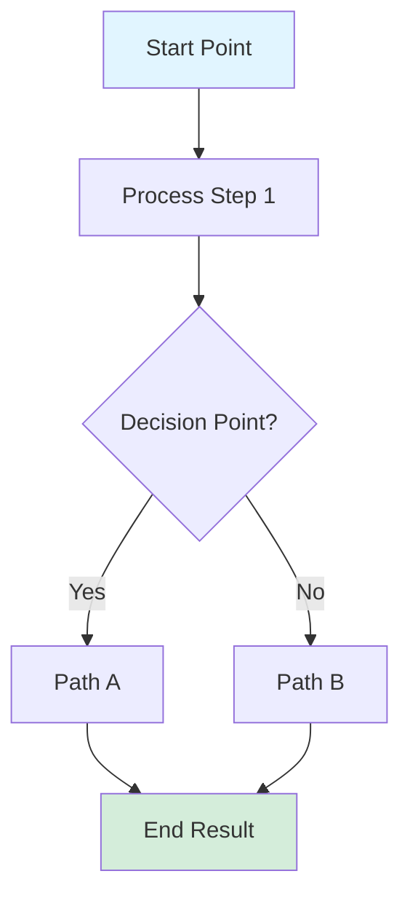
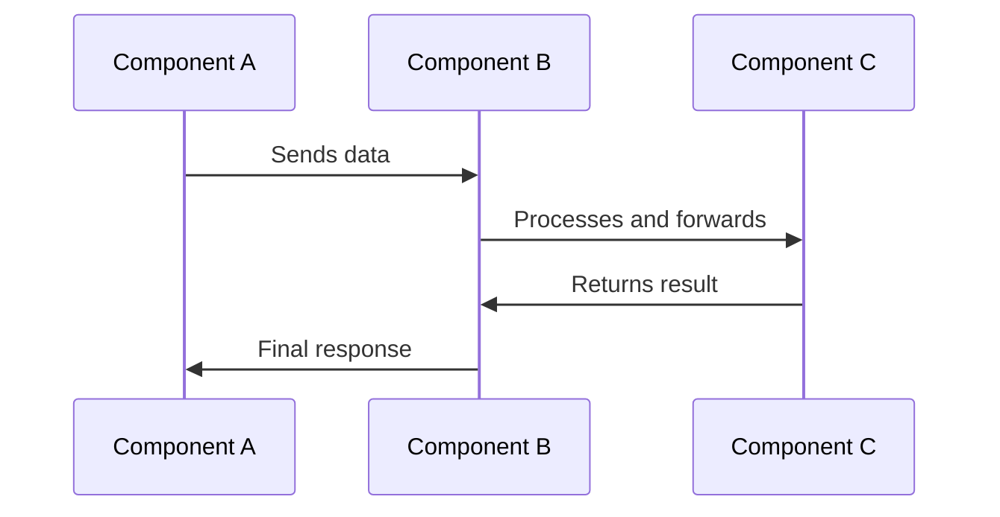

# Conceptual Overview Template

## Introduction

\[2-4 sentences introducing the concept. Explain what it is, why it exists, and why developers should care about it. Make it relatable and practical.]

**In this article:**

* \[What you'll learn 1]
* \[What you'll learn 2]
* \[What you'll learn 3]

**Who should read this:**

* \[Audience 1 - e.g., "Developers integrating payment processing"]
* \[Audience 2 - e.g., "Technical architects designing POS systems"]
* \[Audience 3 - e.g., "Anyone working with EMV transactions"]

## What is \[CONCEPT NAME]?

\[3-5 paragraphs explaining the concept clearly and thoroughly. Use analogies, examples, and plain language. Avoid jargon where possible, or explain it when necessary.]

### Real-World Analogy

\[Use an analogy to make the concept more understandable. For example, if explaining TLV encoding, you might compare it to labeled boxes in a warehouse.]

Think of \[concept] like \[relatable thing]. Just as \[analogy explanation], \[concept] works by \[how it actually works].

### Key Characteristics

\[Concept name] has several important characteristics:

* **\[Characteristic 1]:** \[Explanation of this characteristic and why it matters]
* **\[Characteristic 2]:** \[Explanation]
* **\[Characteristic 3]:** \[Explanation]
* **\[Characteristic 4]:** \[Explanation]

## Why \[CONCEPT NAME] Matters

Understanding \[concept name] is important because:

1. **\[Reason 1]:** \[Detailed explanation of why this matters to developers]
2. **\[Reason 2]:** \[Detailed explanation]
3. **\[Reason 3]:** \[Detailed explanation]

**Impact on your implementation:**

\[Explain the practical impact of understanding this concept on their work]

## How \[CONCEPT NAME] Works

\[Detailed explanation of the mechanism or process. Use diagrams where helpful.]

### The Basic Process



### Step

**\[Step 1]:** \[Explanation of what happens in this step]



### Step

**\[Step 2]:** \[Explanation]



### Step

**\[Step 3]:** \[Explanation]



### Step

**\[Step 4]:** \[Explanation]



### Visual Representation

\[If applicable, include a diagram using Mermaid or an image]



### Detailed Example

Let's walk through a concrete example to illustrate how \[concept] works in practice.

**Scenario:** \[Describe a realistic scenario]

**Step-by-step breakdown:**



### Step 1: \[Step name]

\[Detailed explanation of what happens]

```
[Example data or code showing this step]
```



### Step 2: \[Step name]

\[Detailed explanation]

```
[Example data or code]
```



### Step 3: \[Step name]

\[Detailed explanation]

```
[Example data or code]
```



**Result:**

\[What the final result looks like and what it means]

## Components and Structure

\[If applicable, break down the components that make up this concept]

### Component 1: \[Component Name]

\[Explanation of this component, its role, and how it relates to the overall concept]

**Attributes:**

| Attribute      | Description    | Example          |
| -------------- | -------------- | ---------------- |
| \[Attribute 1] | \[Description] | \[Example value] |
| \[Attribute 2] | \[Description] | \[Example value] |

### Component 2: \[Component Name]

\[Same structure as above]

### How Components Interact

\[Explain how the different components work together]



## Common Use Cases

### Use Case 1: \[Use Case Name]

**When to use:** \[Describe the scenario]

**How it works:** \[Brief explanation of implementation]

**Example:**

```csharp
// Code example demonstrating this use case
[code]
```

### Use Case 2: \[Use Case Name]

\[Same structure as above]

### Use Case 3: \[Use Case Name]

\[Same structure as above]

## Variations and Options

\[If there are different approaches or variations of this concept, explain them]

### Variation 1: \[Variation Name]

**Description:** \[What makes this variation different]

**When to use:** \[Scenarios where this variation is preferred]

**Advantages:**

* \[Advantage 1]
* \[Advantage 2]

**Disadvantages:**

* \[Disadvantage 1]
* \[Disadvantage 2]

### Variation 2: \[Variation Name]

\[Same structure as above]

### Comparison

| Aspect            | Variation 1           | Variation 2           | Variation 3           |
| ----------------- | --------------------- | --------------------- | --------------------- |
| **Performance**   | \[Rating/description] | \[Rating/description] | \[Rating/description] |
| **Complexity**    | \[Rating/description] | \[Rating/description] | \[Rating/description] |
| **Use Case**      | \[Best for...]        | \[Best for...]        | \[Best for...]        |
| **Compatibility** | \[Compatible with...] | \[Compatible with...] | \[Compatible with...] |

## Best Practices


**✅ Recommended Practices:**

* **\[Practice 1]:** \[Explanation of why this is recommended]
* **\[Practice 2]:** \[Explanation]
* **\[Practice 3]:** \[Explanation]



**⚠️ Common Pitfalls:**

* **\[Pitfall 1]:** \[What to avoid and why]
* **\[Pitfall 2]:** \[What to avoid and why]
* **\[Pitfall 3]:** \[What to avoid and why]


## Implementation Considerations

When implementing \[concept name] in your solution, consider:

### Performance Implications

\[Discussion of performance considerations]

**Tips for optimization:**

* \[Tip 1]
* \[Tip 2]
* \[Tip 3]

### Security Considerations

\[Discussion of security aspects]


**Security Note:**

\[Important security information that developers must be aware of]


### Compatibility

\[Discussion of compatibility across different devices, firmware versions, connection types, etc.]

| Device Family  | Support Level        | Notes                     |
| -------------- | -------------------- | ------------------------- |
| DynaFlex       | \[Full/Partial/None] | \[Special considerations] |
| DynaProx       | \[Full/Partial/None] | \[Special considerations] |
| DynaFlex II Go | \[Full/Partial/None] | \[Special considerations] |

## Comparison with Alternatives

\[If there are alternative approaches or related concepts, compare them]

### \[Concept Name] vs. \[Alternative Approach]

**\[Concept Name]:**

* ✅ \[Advantage 1]
* ✅ \[Advantage 2]
* ❌ \[Disadvantage 1]

**\[Alternative Approach]:**

* ✅ \[Advantage 1]
* ✅ \[Advantage 2]
* ❌ \[Disadvantage 1]

**When to choose \[Concept Name]:**

* \[Scenario 1]
* \[Scenario 2]

**When to choose \[Alternative]:**

* \[Scenario 1]
* \[Scenario 2]

## Advanced Topics

\[For readers who want to go deeper]

### \[Advanced Topic 1]

\[Explanation of more advanced aspect of the concept]

### \[Advanced Topic 2]

\[Explanation]


**Deep Dive:**

For more information on \[advanced topic], see \[link to advanced article or external resource].


## Frequently Asked Questions

<details>

<summary>### [Question 1]?</summary>

\[Answer with sufficient detail]

</details>

<details>

<summary>### [Question 2]?</summary>

\[Answer]

</details>

<details>

<summary>### [Question 3]?</summary>

\[Answer]

</details>

## Related Concepts

Understanding \[concept name] builds on or relates to these other concepts:

* **\[Related Concept 1]:** \[Link] - \[Brief explanation of relationship]
* **\[Related Concept 2]:** \[Link] - \[Brief explanation of relationship]
* **\[Related Concept 3]:** \[Link] - \[Brief explanation of relationship]

## Putting It Into Practice

Ready to implement \[concept name]? Here are the next steps:



### Next step

**\[Next step 1]:** \[Link to how-to guide or implementation article]



### Next step

**\[Next step 2]:** \[Link to reference documentation]



### Next step

**\[Next step 3]:** \[Link to code examples]



## Practical Examples

### Quick Example

Here's a simple example showing \[concept] in action:

```csharp
// Brief, focused example
using MagTek.Device;

public class ConceptExample
{
    public void DemonstrateConceptExample()
    {
        // [Code that demonstrates the concept clearly]
        var example = new ConceptImplementation();
        example.Execute();
        // Output shows the concept in action
        Console.WriteLine("Result demonstrates [key aspect of concept]");
    }
}
```

### Complete Implementation

For a more complete implementation, see:

* \[Link to complete how-to guide]
* \[Link to sample project]
* \[Link to video walkthrough]

## Additional Resources

### Documentation

* \[Link to related API reference]
* \[Link to related commands]
* \[Link to related properties]

### External Resources

* \[Link to industry standard or specification]
* \[Link to white paper]
* \[Link to blog post or article]

### Tools and Utilities

* \[Link to helper tool]
* \[Link to testing utility]
* \[Link to validation tool]

## Summary

**Key Takeaways:**

* \[Main point 1]
* \[Main point 2]
* \[Main point 3]
* \[Main point 4]

**Remember:**

\[One or two sentences summarizing the most important thing developers should remember about this concept]


**Need Help?**

For additional support, please contact MagTek Support:

* **Email:** support@magtek.com
* **Phone:** \[Support phone number]
* **Documentation Feedback:** \[Feedback form link]

**Was this article helpful?** \[Feedback link]

